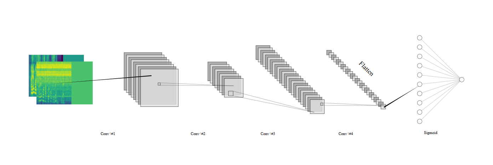
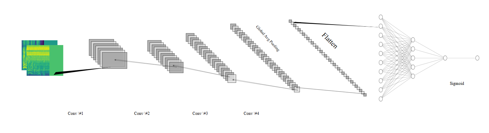
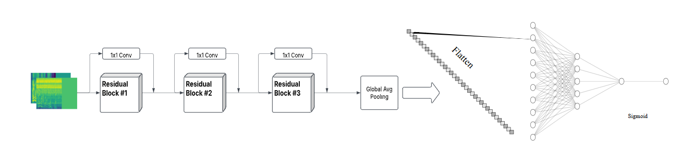
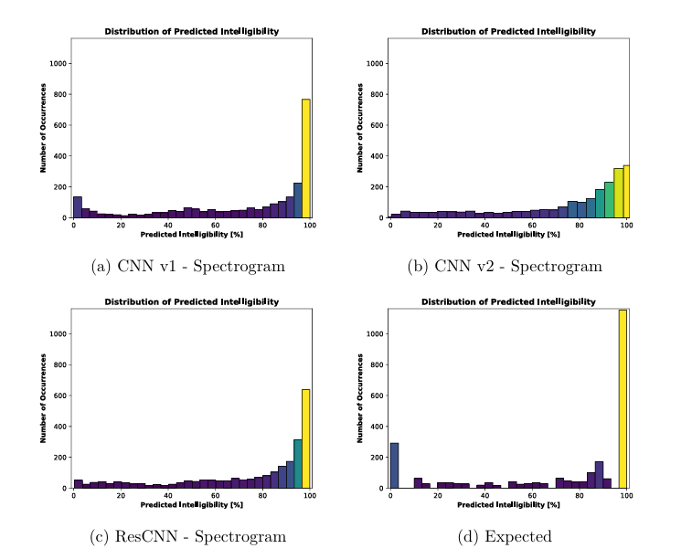
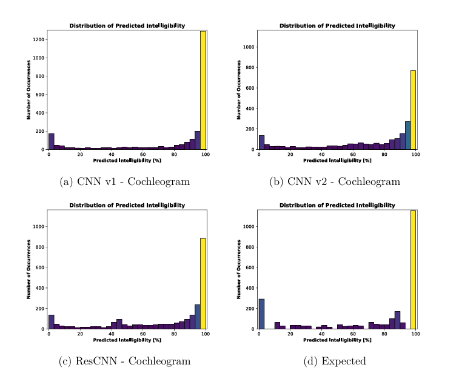
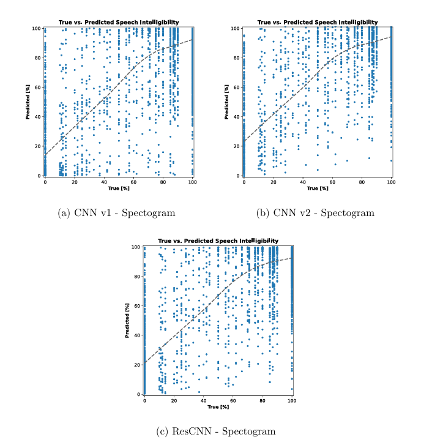
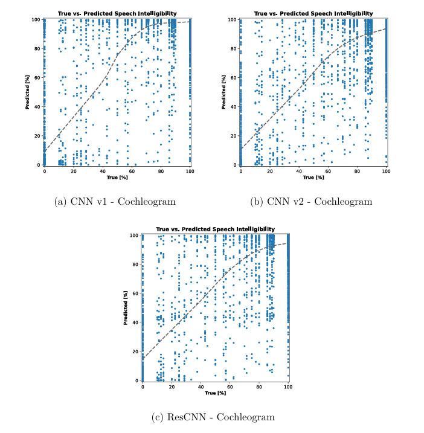

# Speech Intelligibility Prediction with CNN and RCNN

This repository contains code for predicting speech intelligibility using deep learning models based on the Clarity Prediction Challenge ([CPC1](https://claritychallenge.org/docs/cpc1/cpc1_intro)) dataset.

This work was part of a B.Sc. thesis that aimed to investigate and develop neural networks for speech intelligibility prediction, achieving better results than the traditional STOI model.

---

## Overview

The project focuses on utilizing Convolutional Neural Networks (CNN) and Recurrent Convolutional Neural Networks (RCNN) to predict how intelligible speech is to human listeners, especially in noisy environments.

### Why Spectrograms and Cochleograms?

- **Spectrograms**: Provide a time-frequency representation of the audio signal, capturing the spectral features important for speech intelligibility prediction.
  
- **Cochleograms**: Mimic the human ear's processing of sound, offering a more robust feature representation, particularly in noisy environments.

Using both spectrograms and cochleograms gives the model different ways of interpreting the speech signal, improving its performance in various conditions.

---

## Models

The following deep learning models were implemented and evaluated for speech intelligibility prediction:

### CNN v1
The CNN v1 model consists of several convolutional layers designed to capture spatial features from input spectrograms and cochleograms.

  

### CNN v2
The CNN v2 model is an improved version of CNN v1, with a deeper architecture and optimized layers to achieve better performance in speech intelligibility prediction.

  

### ResCNN
The ResCNN model incorporates residual connections to allow for more efficient training and to mitigate the vanishing gradient problem, resulting in improved model performance.

  

---

## Experimentation

### Comparison of Predicted Intelligibility Distributions

The following histogram compares the predicted intelligibility score distributions across all CNN models using **spectrogram features**.

  

The following histogram compares the predicted intelligibility score distributions across all CNN models using **cochleogram features**.

  

The following scatter plot compares the predicted intelligibility scores across all CNN models using **spectrogram features**.

  

The following scatter plot compares the predicted intelligibility scores across all CNN models using **cochleogram features**.

  

### Key Results

- **CNN v2 with spectrogram input** achieved the best performance, offering an optimal balance between accuracy and training time.
- **ResCNN** had the longest training time, but it offered promising performance, especially for deeper feature learning.
- **CNN v1** was faster but less accurate compared to CNN v2.

---

## Conclusion of the Thesis

Through experimentation, we compared the performance of CNN and RCNN models using RMSE and CC, demonstrating that deep learning-based approaches can outperform traditional methods like STOI in speech intelligibility prediction. CNNs trained on spectrograms and cochleograms effectively captured speech intelligibility patterns, leveraging both spectral and temporal information. Among the models tested, CNN v2 with spectrogram input achieved the best trade-off between accuracy and computational efficiency.

---

## Further Work  

- **Hybrid Models**: Future research should explore hybrid architectures that combine CNNs with recurrent components to enhance temporal modeling in speech intelligibility prediction.  
- **Alternative Feature Representations**: Investigating other auditory-inspired feature representations beyond spectrograms and cochleograms may improve model robustness in diverse listening conditions.  
- **Transformer Models**: Exploring transformer-based models, such as Whisper, could provide better feature extraction and advance intelligibility prediction performance.  

## Acknowledgements

This work was part of the Clarity Prediction Challenge 1 (CPC1) and was based on the dataset provided by [The Clarity Project](https://claritychallenge.org).
