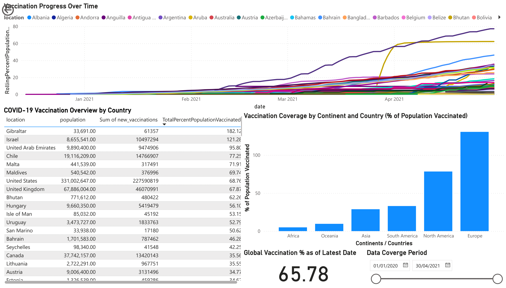

# Project 01 – COVID-19 Data Exploration

## 📘 Overview
This project explores global COVID-19 data through SQL queries and visualization dashboards.  
The goal is to analyze infection, vaccination, and mortality trends across countries and over time.

---

## 📂 Project Structure
- **covid19_data_exploration.sql** – SQL script used to explore and analyze COVID-19 datasets.  
- **COVID19_Vaccination_Dashboard.pbix** – Power BI dashboard visualizing vaccination progress.  
- **COVID19_Vaccination_Dashboard.png** – Preview of the Power BI dashboard.  
- **raw_dataset/** – Contains raw input data files.  
- **ready_dataset/** – Contains processed and cleaned data used for analysis.

---

## 🧠 Analysis Highlights
- Examined global trends in COVID-19 cases, deaths, and vaccination rates.  
- Calculated death percentage for individual countries (e.g., Azerbaijan).  
- Determined COVID-19 impact on population (% infected) per country.  
- Identified countries and continents with highest infection and death rates.  
- Combined COVID-19 death and vaccination datasets to analyze vaccination rollout relative to population.  
- Used CTEs and temporary tables to compute rolling vaccinations and percentage of population vaccinated.

---

## 🧩 SQL View Creation
A SQL view named **`PercentPopulationVaccinated`** was created to streamline vaccination analysis.  
The view calculates cumulative vaccination counts over time for each country, making it easier to analyze trends and visualize vaccination progress in Power BI.

---

## 📊 Power BI Visualization
The SQL view **`PercentPopulationVaccinated`** was used as the data source for the **COVID-19 Vaccination Dashboard** in Power BI.

The dashboard visualizes:
- Global and continental vaccination progress  
- Comparison of vaccination rates relative to population  
- Trends in total cases, deaths, and vaccinations over time  

All visuals are included in the Power BI file:  
**`COVID19_Vaccination_Dashboard.pbix`**

---

## 🛠️ Tools Used
- **SQL Server** – for data exploration, transformation, and creating views  
- **Power BI** – for interactive dashboard creation and data visualization  
- **Excel / CSV datasets** – as input data sources for analysis  

---

## 📈 Dashboard Preview

